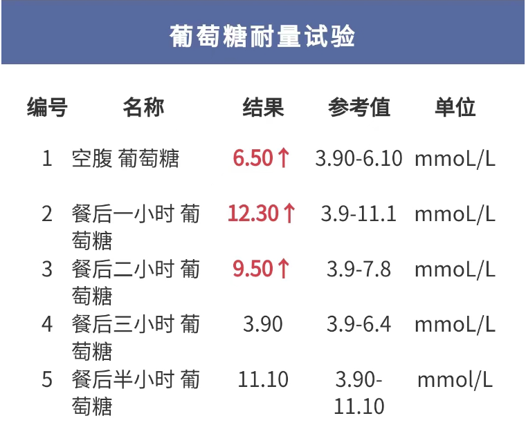
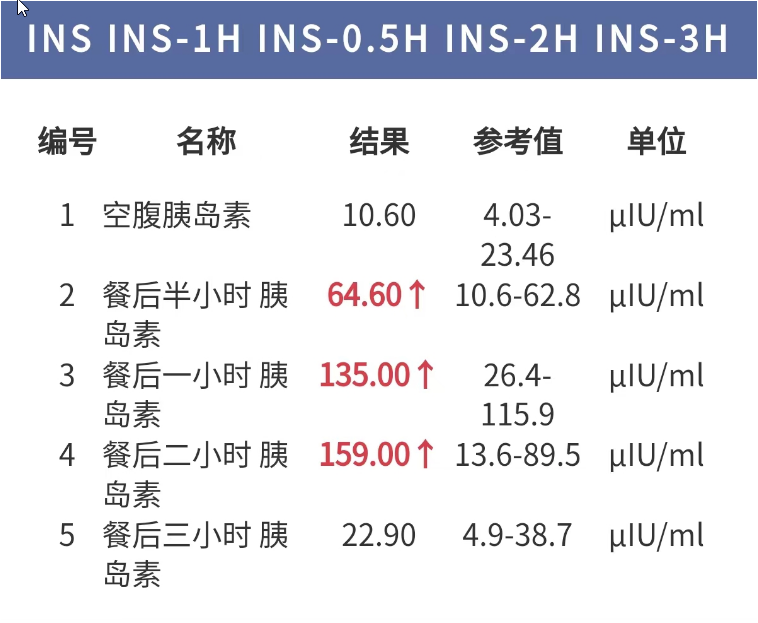
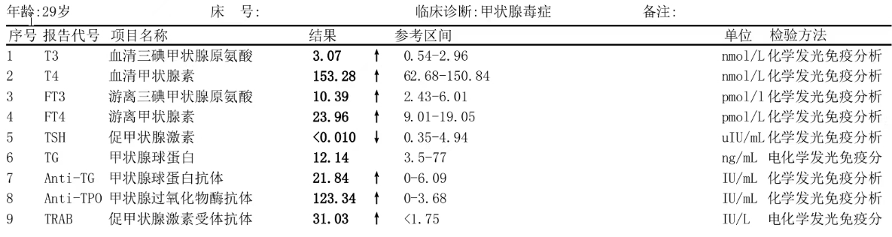

# 为什么做一个这样的APP

## 作者交代

* 作者，Y先生（化名，其实就是本人哈，但是不好做第一人称叙述，所有后面统一称Y先生）
* 工作，国内网络安全头部公司程序猿，主要方向数通和VPN以及资产识别方向（对Android和Java以及Kotlin完全不了解）日常使用语言：C/C++、Python
* 糖尿病患者，查出糖尿病一年，前期`控糖失败`，之后沦为一名小糖人
* 已婚，哈哈，这个就很搞笑

## 工作量交代

自学 Android Studio环境搭建，主要是有的需要科学上网，就很恶心，自学：一点点Java语法，一点点Kotlin，一点点Android布局，5人日落地该项目，该项目起点，为2023年年底做高铁回家过年时，真正动手时为2024年正月初四，Y先生的媳妇因为是银行从业人员，开始上班了，所有就跟着去她单位了，闲来无事，开始构思app的事情，一直到正月初七，项目初步落地

## 为什么控糖失败了

Y先生的母亲，2022年6月因身体极速消瘦，后晕倒送医救治，诊治为糖尿病，后住院控制，半月后出院，后续一直吃药和胰岛素控制，血糖基本稳定，后知道糖尿病有遗传的可能性，2022年10月Y先生在医院做了糖耐量实验

<b>&nbsp;糖耐量之葡萄糖#检查报告</b>

 

<b>&nbsp;糖耐量之胰岛素#检查报告</b>

 

嗯，胰岛素抵抗，糖尿病前期，当时Y先生28岁，如同晴天霹雳一般，档案有遗传的因素，但Y先生认为更多是自身的原因，因为长期久坐，这极大了增加了患糖尿病的因素，但当时完全有逆转的可能性，Y先生积极的听取医生的建议，增加每日运动量，在2022年10月至2023年2月，用时大概3个月，Y先生不吃药，不打针，通过饮食和运动，成功控制住的血糖，体重也减轻了9公斤（Y先生的BMI指数29），并且脂肪肝没了，这对于Y先生来说是一个好消息，后续继续跑步，2023年公司体检，甲状腺超声显示回声不均，到大医院复查时，诊断为甲亢，同时检查了糖化血红蛋白，和血糖，在跑步和打羽球的情况下，血糖没有控制住，反而有上涨的趋势，这完全不是半年前的情况，`医生针对甲亢和糖尿病给出了分析是，因为甲亢加速了身体代谢，促进了肠葡萄糖的吸收及促进糖原异生，加剧了糖尿布的恶化`,呵呵，有一句骂人的话想要说出口，医生针对Y先生的情况给开了`二甲双胍[格华止]+阿卡波糖片[拜糖平]+甲疏咪唑[赛治]`

<b>&nbsp;甲功全套#检查报告</b>

 

并且对Y先生千叮咛万嘱咐，不要剧烈运动，糖尿病的基本属于板上钉钉了，这辈子可能逃不掉了，当然Y先生也查了很多文献，糖尿病控制得当的话，不会影响生活，Y先生买了血糖仪，按时监控血糖，开始漫漫的抗糖道路

## 为什么做一个这样的APP

Y先生想要有一个记录血糖的软件需要满足一下条件：

1. 最好是手机上
2. 能够生成图表显示一个时间段的控糖效果
3. 数据保留在本地
4. 不注册不实名

但是找了一圈，当前的血糖记录app基本都和厂商管理，懂得都懂：

1. 广告投放，一步操作两个广告
2. 需要登录，需要实名
3. 数据上云
4. 功能丰富

数据上云和实名登录一直是Y先生担心的，这个很容易成为某厂商，某宝，某东，某多针对，刚实名后，就会在各个购物软件给你各种推荐，烦不胜烦，甚至包括某头条，也在悄悄的投放广告和血糖，糖尿病相关的资讯

所有这个app诞生了，这个app保证了不登录，不联网（数据不上云），简单的图表功能
