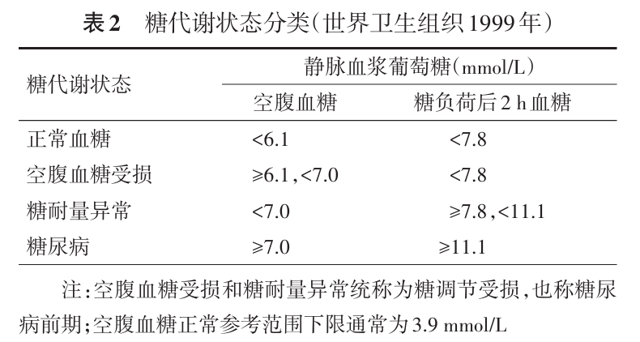
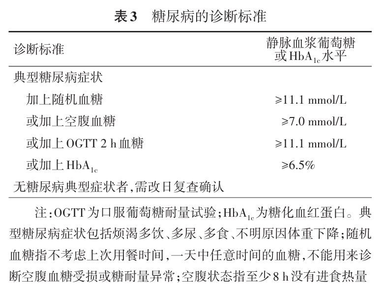

# TRed

TRed是一个糖尿病综合防治项目，目前该项目包含以下内容

1.  糖尿病防治资料知识库(提供的知识和资料不做任何诊断依据，所有资料均来自互联网，本人对资料导致的结果不承担任何责任)
2.  一个不用联网，不用登录的记录血糖的APP

`知识库是一个长期建立的过程，目前重心放在TRed记录血糖APP的开发上，知识库不定时更新`

目前提供一个关于糖尿病知识库网站[中华糖尿病杂志](https://zhtnbzz.yiigle.com/)

## TRed-wiki-糖尿病知识库

### 糖尿病诊断相关标准

这些知识一般来自于[中国2型糖尿病防治指南-2020年版](assets/中国2型糖尿病防治指南-2020年版.pdf)这个文档

糖尿病按照病因分为T1DM、T2DM、特殊类型糖尿病和妊娠期糖尿病4种类型

<b>&nbsp;糖代谢状态分类</b>

 

<b>&nbsp;糖尿病的诊断标准</b>

 

如果空腹血糖>=6.1mmol/L或者随机血糖>=7.8mmol/L，建议行OGTT(糖耐量测试)

<b>&nbsp;2型糖尿病患者常见检查的推荐频率</b>

 

### 血糖的正常值

血糖达标的三个标准是空腹血糖、餐后2小时血糖及糖化血红蛋白均达标。

|              | 空腹       | 餐后半小时 | 餐后1小时  | 餐后2小时 | 餐后3小时 |
| ------------ | ---------- | ---------- | ---------- | --------- | --------- |
| 葡萄糖       | 3.9-6.1    | 3.9-11.1   | 3.9-11.1   | 3.9-7.8   | 3.9-6.4   |
| 胰岛素       | 4.03-23.46 | 10.6-62.8  | 26.4-115.9 | 13.6-89.5 | 4.9-38.7  |
| 糖化血红蛋白 | ＜6%       |            |            |           |           |

上述表中的数据来自医院检查单上的对比数据，仅供参考

[中国2型糖尿病防治指南-2020年版.pdf](assets/中国2型糖尿病防治指南-2020年版.pdf)

## TRed-APP-糖尿病记录软件

正如描述中所述，TRed记录血糖不需要登录，不需要联网(当然后面要加入自动更新的话，很难避免完全不联网，但我能做到的就是，`仅更新时联网`，其他的任何场景不联网)

| 功能 | 子功能                                                       | 描述         | 实现 | 说明 |
| ---- | ------------------------------------------------------------ | ------------ | ---- | ---- |
| 记录 | 以 1. 血糖(单位mmol/L) 2. 标签(空腹[^0]、餐前[^1]、餐后[^2]、睡前[^3]、随机[^4]) 3. 日期时间 三个维度记录血糖，存储方式为sqlite数据库 | 基础功能     | ✅    |      |
| 查询 | 以 日期为主要维度，时间为次要维度展示查询结果 数据归一化处理，按照每日进行归一化展示 并且将删除添加在数据长按操作中 | 基础功能     | ✅    |      |
| 统计 | 以 标签为主要维度，时间为次要维度进行数据统计绘制趋势图   | 基础功能     | ✅    |      |
| 设置 | 1. 在线更新 ✅ 2. 导出sql到本地文件 ✅ 3. 从本地导入sql文件，自动去重 ✅ | 基础功能     |      |      |
| 开发 | 1. 后续准备将知识库Markdown直接打包进APP中，这样不违背除了更新之外不涉及联网的事情，但是APP的大小不好控制，现在只是构想 2. 优化查询界面的布局 | 后续开发计划 |      |      |

[^0]: 空腹，是指，8-12小时未进食的情况下的血糖测量，<=6.1mmol/L
[^1]: 餐前，是指用餐前的血糖
[^2]: 餐后，是指第一口饭开始计时2小时后的血糖测量，<=7.2mmoL/L
[^3]: 睡前，是指22点，或者临睡前的血糖
[^4]: 随机，是指任何时候测量的血糖，<=11.1mmol/L