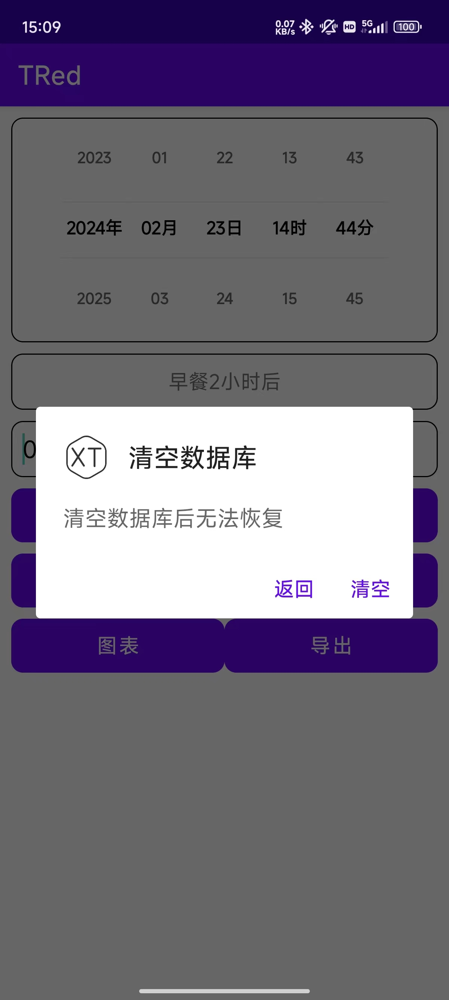
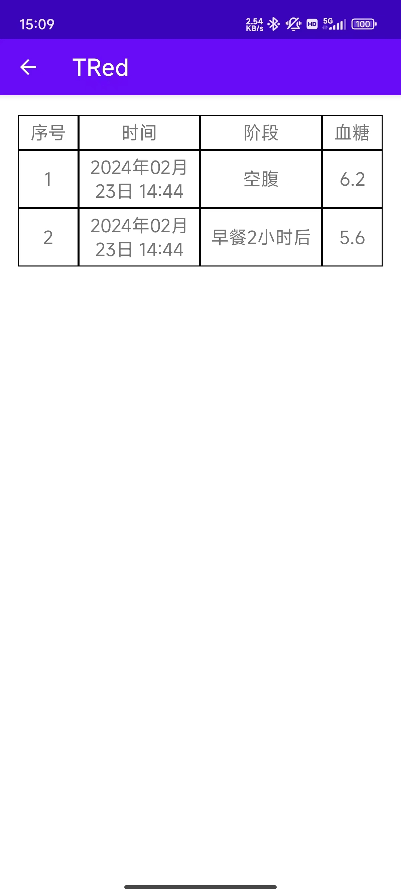
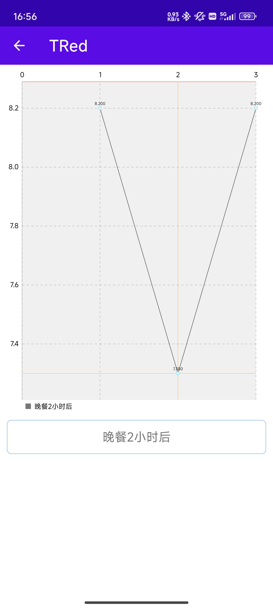

# TRed

这是一个记录血糖的app

## 交代一下为什么做一个这样的APP

[罗里吧嗦的交代，点击这里](abort/purpose.md)

## 这个APP的一些图片

<b>&nbsp;首页</b>

 

<b>&nbsp;添加</b>

 

<b>&nbsp;查看</b>

 

<b>&nbsp;图表</b>

 

## 更新计划

[更新计划点击这里](abort/update.md)包含内容如下：

1. app功能介绍
2. 开发计划
3. 代码部分介绍

